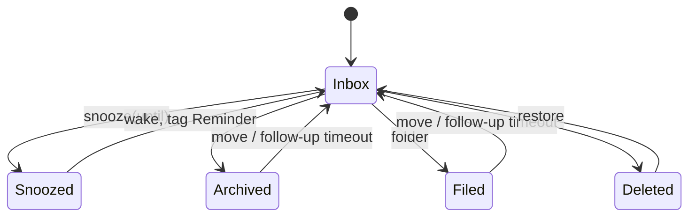

# Triage model & UI spec

Goal: a triage system with a minimal learning curve. You open the inbox, and every
message falls into one of a few obvious outcomes:

| Intent | Outcome |
|---|---|
| Needs a response | Reply → post-send dialog files original + reply; thread tagged *Awaiting Reply* if the classifier expects an answer |
| Interesting, read now | Read → Archive or File |
| Interesting, read later | Snooze (always with a wake time) |
| Uninteresting, might need later | Archive or File |
| Uninteresting | Delete |

## States

Every message has exactly one state.

| State | Meaning | Leaves via |
|---|---|---|
| `Inbox` | Default for all incoming mail | Snooze / Archive / File / Delete |
| `Snoozed(until)` | Hidden until `until`; always has a wake time | `tick(now)` → Inbox + *Reminder* tag; manual move |
| `Archived` | Low-commitment put-away | Manual move; follow-up timeout |
| `Filed(folder)` | Intentionally sorted into a folder of its account | Manual move; follow-up timeout |
| `Deleted` | Trash | Restore / undo |

Removed: `Waiting`, `Later` without a wake time ("parked"), the separate Screener
view, hidden mail for blocked/unsubscribed senders.

Deferred: mute. Muted threads keep today's behavior until redesigned.

## Tags

Tags are metadata beside the state.

| Tag | Set by | Cleared by |
|---|---|---|
| Needs Reply | Classifier | Sending a reply in the thread |
| Awaiting Reply | Classifier, on send, when a response is expected | A newer message arriving in the thread |
| Follow Up | `tick`, when an Awaiting Reply thread passes the global timeout with no answer (thread returns to Inbox) | Any state change |
| Reminder | `tick`, when a snooze wakes | Any state change |
| New Sender | Sender not in contacts (schema kept; off in v1 — see `src/known_senders.rs`) | Allow sender |
| Possible Spam | Classifier | Any state change |
| Urgent(n), Kind | Classifier | — |

`Tag::Spam` and `Tag::NoReply` are removed.

## Actions & dialogs

Every user action is one undo step.

- **Reply sent**: dialog *Archive / File… / Delete / Keep in Inbox*, applied to the
  original and the sent reply. Sending clears Needs Reply; if the classifier expects
  a response, the thread gets Awaiting Reply.
- **Reply arrives** on an Awaiting Reply thread: the new message lands in Inbox; the
  thread's Awaiting Reply is cleared.
- **Follow-up timeout**: a global setting ("How long to wait for a response before
  flagging"). On expiry the thread returns to Inbox tagged Follow Up.
- **Block sender / Unsubscribe**: dialog offering to move that sender's Inbox mail to
  *Delete / Archive / File…*, or *Leave*. Declining changes nothing. Future mail is a
  provider concern (out of scope for mock data).
- **Unblock**: Settings → Blocked senders list. Unsubscribe is one-way (resubscribe
  happens at the original subscription).
- **Mark spam**: dialog *Block & Delete / Delete*.
- **New sender**: off in v1 (see `src/known_senders.rs`). When enabled, Allow removes
  New Sender (and records the contact); Block runs the block dialog.
- **Sender-wide actions** always confirm first.

## Accounts & folders

- Multiple accounts; each has its own folders (a tree). Mock: seeded from
  `fixtures/`, creatable from the File picker. Later: synced with the provider
  (local SQLite copy, sync on open; creating a folder creates it remotely).
- Every message belongs to one account. `Filed(folder)` refers to a folder of that
  account.
- Sent messages live in the account's Sent location and are also filed with their
  thread.

## UI

- **Left sidebar** (replaces the tab bar / "N to triage"):
  - *All Inboxes* (default landing view)
  - per account: Inbox, Snoozed, Sent, Archive, Trash, then folders (collapsible)
- **Chip row**: quick filters, only on Inbox views (All Inboxes or one account's
  Inbox). Single-select, fixed set, no counts:
  All · Needs Reply · Follow Up · Urgent · Possible Spam (New Senders is off in v1)
- **Filter ▾ menu**: every location; filter by tag, Kind, account.
- **Rows**: tag badges; account icon (per-account icon + color) before the sender in All Inboxes.
- **Accounts**: each has an icon + color (shown in the sidebar and All Inboxes rows) and an optional nickname (Settings → Accounts); a blank nickname means unset and the account name is shown.
- **Viewer**: Archive / File / Delete / Snooze in each message's `⋯` menu; banner for
  Possible Spam (Block & Delete / Delete). The New Sender (Allow / Block) banner is off in v1.

### Keys

| Key | Action |
|---|---|
| `e` | Archive |
| `f` | File (folder picker) |
| `d` / `#` | Delete |
| `s` | Snooze |
| `r` | Reply |
| `a` / `b` | Allow / Block sender |
| `!` | Mark spam |
| `1`–`6` | Chips |
| `g` + letter | Jump to sidebar location |

Sender-wide variants use `shift-` and confirm first.
